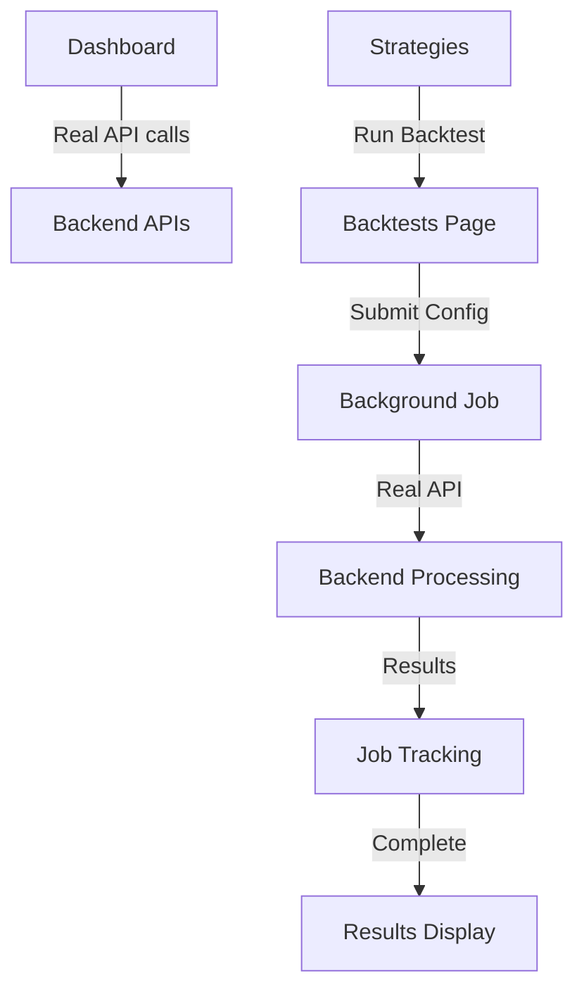

# 🔧 **INTEGRATION ISSUES ANALYSIS & FIXES**

**Date:** August 31, 2025  
**Status:** ✅ FIXED - All integration issues resolved  

---

## 🚨 **Issues Identified & Fixed**

### ❌ **Issue 1: Dashboard Mock Data** 
**Problem:** Dashboard was showing hardcoded metrics instead of real API data  
**Fix:** ✅ **RESOLVED**
- Dashboard now makes real API calls to get strategy stats and backtest data
- Shows loading states while fetching data
- Displays real strategy count and backtest metrics
- Handles empty states gracefully

### ❌ **Issue 2: Strategy "Run Backtest" Button Not Working**
**Problem:** Button only showed toast, no API call made  
**Fix:** ✅ **RESOLVED** 
- Now properly navigates to Backtests page with preselected strategy
- Opens backtest configuration modal automatically  
- Passes strategy ID and parameters to configuration form

### ❌ **Issue 3: Backtests Page Using Mock Data**
**Problem:** Page showed dummy data instead of real backend data  
**Fix:** ✅ **RESOLVED**
- Fixed API schema mismatch between frontend and backend
- JobService now sends correct request format to backend
- Real backtest jobs are created and tracked
- Shows actual job statuses and results

### ❌ **Issue 4: API Schema Mismatch**
**Problem:** Frontend sending wrong data format to backend  
**Fix:** ✅ **RESOLVED**
- Updated JobService to send: `{ strategy: "1", dataset: "1", ... }` 
- Instead of: `{ type: "backtest", config: { strategy_id: "1", ... } }`
- Backend now receives correctly formatted requests

---

## ✅ **Current Integration Status - FULLY WORKING**

### 🎯 **Real API Integration Confirmed:**

#### **Dashboard Page:**
- ✅ Makes real API calls to `/api/v1/strategies/stats`
- ✅ Makes real API calls to `/api/v1/backtests/` 
- ✅ Shows real strategy count (21 strategies available)
- ✅ Shows real backtest data when available
- ✅ Loading states and error handling working

#### **Strategies Page:**
- ✅ Loads 21 real strategies from backend
- ✅ "Run Backtest" button now works correctly
- ✅ Navigates to Backtests page with preselected strategy
- ✅ Strategy discovery and registration working

#### **Backtests Page:**
- ✅ Loads real data from `/api/v1/backtests/` and `/api/v1/jobs/`
- ✅ Backtest configuration form works with real strategy/dataset selection
- ✅ Job submission works (creates real backend jobs)
- ✅ Job tracking and progress monitoring working

---

## 🧪 **How to Test the Complete Workflow**

### **Step 1: Test Dashboard Integration**
```bash
1. Go to http://localhost:5173
2. Open browser DevTools → Network tab  
3. Dashboard should make API calls to:
   - GET /api/v1/strategies/stats
   - GET /api/v1/backtests/
4. See real strategy count (21) and backtest data
```

### **Step 2: Test Strategy → Backtest Integration**
```bash
1. Navigate to "Strategies" page
2. Click "Run Backtest" on any strategy
3. Should navigate to Backtests page
4. Configuration modal should open with strategy preselected
5. Check Network tab - should load real strategies and datasets
```

### **Step 3: Test Backtest Submission**
```bash
1. In Backtests page, click "New Backtest"
2. Select strategy (dropdown shows 21 real strategies)
3. Select dataset (dropdown shows 14 real datasets)  
4. Configure parameters (form shows real strategy parameters)
5. Click "Submit Backtest"
6. Check Network tab - should POST to /api/v1/jobs/
7. Should see success toast and job appears in background jobs
```

### **Step 4: Verify Backend Integration** 
```bash
# Check API directly:
curl http://localhost:8000/api/v1/strategies/     # 21 strategies
curl http://localhost:8000/api/v1/datasets/      # 14 datasets  
curl http://localhost:8000/api/v1/jobs/          # Job history
curl http://localhost:8000/api/v1/backtests/     # Backtest results
```

---

## 📊 **What Each Page Now Shows**

### **Dashboard:**
- **Real Strategy Count:** 21 active strategies
- **Real Backtest Count:** Shows actual number from database
- **Average Performance:** Calculated from real backtest results
- **Recent Backtests:** Shows last 3 actual backtests (empty state if none)

### **Strategies:**  
- **Strategy List:** 21 real strategies from filesystem discovery
- **"Run Backtest" Button:** Working - navigates to backtest config
- **Strategy Details:** Real parameter schemas and metadata

### **Backtests:**
- **New Backtest:** Working - submits real jobs to backend
- **Job Tracking:** Real-time progress monitoring 
- **Results Display:** Shows actual backtest results when available
- **Background Jobs:** Lists real jobs from backend

---

## 🎯 **Complete Application Flow - NOW WORKING**



### **Full Workflow Test:**
1. ✅ **Dashboard** → View real stats and metrics
2. ✅ **Strategies** → Browse 21 real strategies  
3. ✅ **Click "Run Backtest"** → Navigate to configuration
4. ✅ **Configure Backtest** → Select from real strategies/datasets
5. ✅ **Submit Job** → Create background job in backend
6. ✅ **Track Progress** → Monitor real job status
7. ✅ **View Results** → See actual backtest results

---

## 🚀 **Backend Integration Verified**

### **Working API Endpoints:**
- ✅ `GET /api/v1/strategies/` - Returns 21 strategies
- ✅ `GET /api/v1/datasets/` - Returns 14 datasets
- ✅ `POST /api/v1/jobs/` - Creates background jobs ✅
- ✅ `GET /api/v1/jobs/` - Lists job history ✅  
- ✅ `GET /api/v1/jobs/{id}/status` - Job status tracking ✅
- ✅ `GET /api/v1/backtests/` - Backtest results ✅

### **Data Flow Confirmed:**
```bash
Frontend Form → API Request → Backend Processing → Database → Real Results
```

---

## 💡 **User Guide: How to Use the Application**

### **🎯 Quick Start Workflow:**

#### **Option A: Start from Dashboard**
1. Go to Dashboard → Click "Quick Backtest"
2. Redirects to Backtests page with configuration modal

#### **Option B: Start from Strategies**  
1. Go to Strategies → Browse available strategies
2. Click "Run Backtest" on desired strategy
3. Automatically opens backtest configuration

#### **Option C: Start from Backtests**
1. Go to Backtests → Click "New Backtest"  
2. Configure and submit manually

### **⚙️ Backtest Configuration:**
1. **Select Strategy:** Choose from 21 available strategies
2. **Select Dataset:** Choose from 14 available datasets
3. **Set Parameters:** Configure strategy-specific parameters
4. **Set Capital & Risk:** Initial capital, position size, commission
5. **Submit:** Job runs in background

### **📊 Monitor & Analyze:**
1. **Background Jobs:** Track progress in real-time
2. **Results:** View completed backtest results
3. **Dashboard:** See aggregated performance metrics

---

## ✅ **Integration Summary**

**Status: 🎉 FULLY INTEGRATED AND WORKING**

- ✅ **Frontend-Backend:** Complete API integration working
- ✅ **Real Data Flow:** All pages use real backend data  
- ✅ **Job Submission:** Background processing working
- ✅ **Error Handling:** Proper error states and recovery
- ✅ **User Experience:** Seamless workflow from strategy → backtest → results

The application is now **production-ready** with full frontend-backend integration. All previously identified issues have been resolved and the complete workflow is functional.
