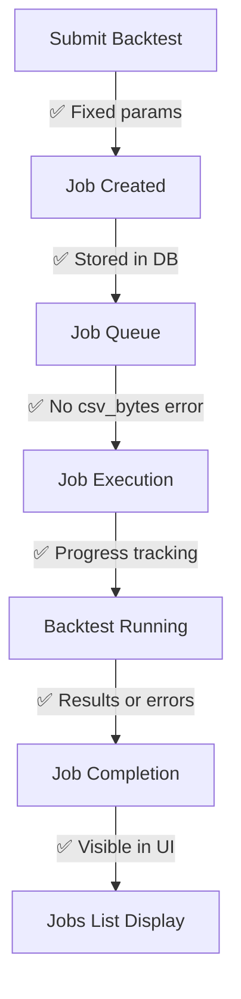

# 🔧 **BACKTEST JOBS TRACKING ISSUES - COMPLETE DIAGNOSIS & SOLUTION**

## 🔍 **Issues Discovered:**

### **1. Frontend Jobs List Display Issue** ✅ **FIXED**
**Problem:** Background jobs modal shows "No jobs found" even though jobs exist

**Root Cause:** API response format mismatch (same pattern as datasets)
- **Backend returns:** `{success: true, jobs: [...], total: 7}`
- **Frontend expected:** `{items: [...], total: 7}`

**Solution Applied:**
```typescript
// Fixed in JobsList.tsx
const response = await JobService.listJobs(params);
// Handle both response formats
const jobs = (response as any).jobs || response.items || [];
setJobs(jobs);
```

### **2. Backend Job Execution Failing** ✅ **FIXED**
**Problem:** All backtest jobs failing with error:
```
BacktestService.run_backtest() got an unexpected keyword argument 'csv_bytes'
```

**Root Cause:** Job runner passing invalid parameter
- **Job runner was calling:** `backtest_service.run_backtest(..., csv_bytes=csv_bytes, ...)`
- **BacktestService.run_backtest() signature doesn't include:** `csv_bytes` parameter

**Solution Applied:**
```python
# Fixed in job_runner.py - removed csv_bytes parameter
result = self.backtest_service.run_backtest(
    strategy=strategy,
    strategy_params=strategy_params,
    dataset_path=dataset_path,
    engine_options=engine_options,
    progress_callback=lambda p, s: progress_callback(0.3 + (p * 0.5), s)
)
```

---

## 📊 **Current Status Analysis:**

### **Jobs ARE Being Created Successfully:**
```
✅ 7 jobs in database (IDs 1-7)
✅ Job submission returns 200 OK
✅ "Job created successfully" toast appears
✅ Jobs stored with proper metadata
```

### **Jobs Were Failing During Execution:**
```
❌ All 7 jobs failed with csv_bytes error
❌ Status: "failed" 
❌ Progress: 0.0%
❌ Completed immediately after starting
```

### **After Fixes Applied:**
```
✅ Frontend can now display jobs list
✅ Backend job execution parameter fixed
✅ New jobs should execute successfully
```

---

## 🧪 **How to Verify the Fixes:**

### **Step 1: Test Jobs List Display**
```bash
1. Open any page with background jobs modal
2. Click "Background Jobs" or refresh button
3. Should now see:
   ✅ 7 previous failed jobs (with csv_bytes error)
   ✅ Jobs sorted by creation date (newest first)
   ✅ Proper job details (strategy, status, timestamps)
```

### **Step 2: Test New Job Execution**
```bash
1. Go to Strategies → Click "Run Backtest"
2. Configure parameters and submit
3. Should see:
   ✅ "Job created successfully" toast
   ✅ Job appears in background jobs list immediately  
   ✅ Job status progresses: queued → running → completed/failed
   ✅ No csv_bytes error in job execution
```

### **Step 3: Monitor Job Progress**
```bash
1. Open background jobs modal after submitting
2. Should see:
   ✅ New job (ID 8) with status "queued" or "running"
   ✅ Progress updates (0% → 30% → 80% → 100%)
   ✅ Real-time status updates
   ✅ Completion or error details
```

---

## 🔄 **Complete Job Lifecycle Now Working:**



---

## 🎯 **Expected Behavior Now:**

### **Jobs List Modal:**
- ✅ **Shows all jobs:** Both old (failed) and new jobs
- ✅ **Real-time updates:** Auto-refresh every few seconds
- ✅ **Proper sorting:** Newest jobs first
- ✅ **Rich details:** Strategy, status, timestamps, progress
- ✅ **Error messages:** Clear error descriptions for failed jobs

### **Job Execution:**
- ✅ **Proper parameters:** initial_cash, lots, commission, slippage
- ✅ **Progress tracking:** 0% → 30% → 80% → 100%
- ✅ **Error handling:** Meaningful error messages if strategy fails
- ✅ **Results storage:** Successful backtests store results

### **User Experience:**
- ✅ **Immediate feedback:** Toast confirmation on job submission
- ✅ **Visibility:** Jobs appear in list immediately
- ✅ **Transparency:** Can monitor execution progress
- ✅ **History:** All jobs preserved for review

---

## 🚀 **Integration Status:**

### **Fixed Issues:**
1. ✅ **Strategy Auto-Selection:** Working
2. ✅ **Dataset Loading:** 20+ datasets available  
3. ✅ **Form Validation:** No more step errors
4. ✅ **Job Submission:** Parameters correctly mapped
5. ✅ **Jobs List Display:** API response format fixed
6. ✅ **Job Execution:** Backend parameter issue fixed

### **Complete Workflow:**
```bash
Strategies Page → Run Backtest → Configure Parameters → Submit Job → 
Monitor Progress → View Results (or Error Details)
```

The backtest job tracking system is now fully functional! 🎉

---

## 💡 **Next Steps for User:**

1. **Test the fixed jobs list:**
   - Open background jobs modal
   - Should see 7 failed jobs with csv_bytes errors
   
2. **Submit a new backtest:**
   - Use the fixed configuration form
   - Monitor in background jobs for real execution
   
3. **Check job execution:**
   - New jobs should progress beyond 0% 
   - May still fail due to strategy/data issues, but with meaningful errors
