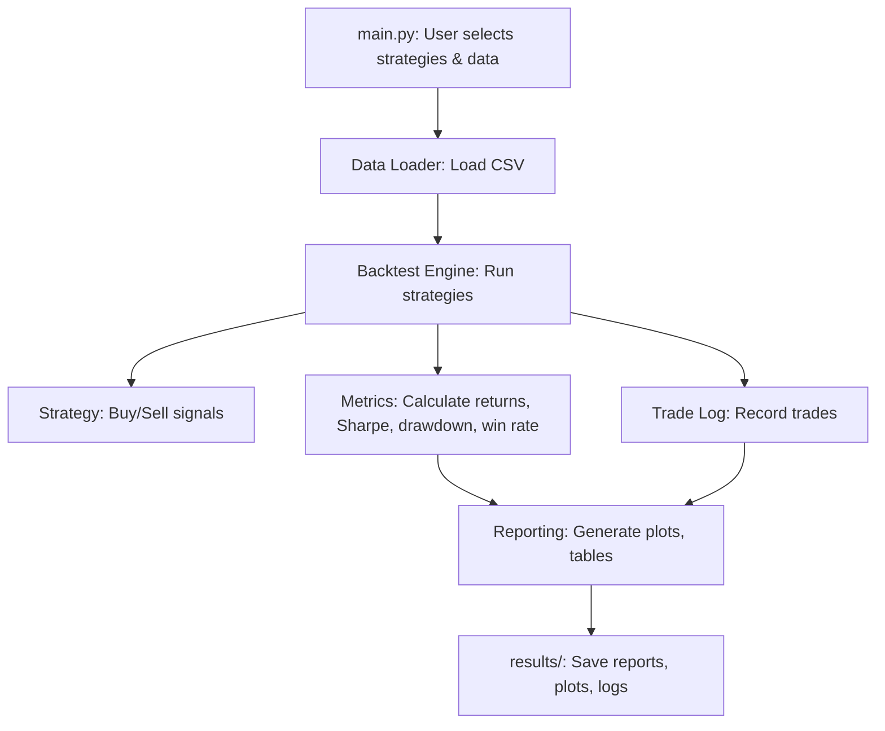

# Trading Backtester Framework: Project Plan

## Overview

A modular, extensible Python backtesting framework for analyzing and comparing trading strategies using intraday historical data. The framework will support both simple (e.g., moving average crossover) and custom Python strategies, with rich performance metrics and dynamic, informative visualizations.

---

## Project Structure

```
trading-backtester-v1/
│
├── data/                        # Historical data CSVs
├── strategies/                  # User-defined strategy scripts
│   └── (e.g., moving_average.py, breakout.py)
├── backtester/                  # Core framework code
│   ├── __init__.py
│   ├── engine.py                # Backtest engine
│   ├── data_loader.py           # Data loading utilities
│   ├── metrics.py               # Performance metrics
│   ├── reporting.py             # Plots, tables, logs
│   └── strategy_base.py         # Base class/interface for strategies
├── results/                     # Output: logs, plots, reports
├── main.py                      # Entry point: run backtests, compare
└── requirements.txt             # Python dependencies
```

---

## Core Components & Flow



---

## Key Design Points

- **Strategy Interface:**  
  - All strategies inherit from a base class (e.g., `StrategyBase`) and implement a `generate_signals()` method.
  - Users can add new strategies by creating new Python files in the `strategies/` directory.

- **Backtest Engine:**  
  - Loads data, applies strategy, simulates trades (entry/exit, position sizing, slippage, commissions).
  - Records trades and portfolio value over time.

- **Metrics Module:**  
  - Calculates total return, Sharpe ratio, max drawdown, win rate, and other metrics.

- **Reporting Module:**  
  - Generates dynamic, interactive, and informative plots (using matplotlib, seaborn, or plotly).
  - Plots will visualize:
    - Equity curve
    - Entry/exit points on price chart
    - Profit/loss trades (color-coded)
    - Indicators used by the strategy
    - Drawdown periods
    - Trade-by-trade P&L
    - Any other analytics helpful for strategy analysis
  - Generates trade logs (CSV/HTML) and comparison tables for multiple strategies.

- **Extensibility:**  
  - New strategies: Drop in a new Python file in `strategies/`.
  - New data: Place new CSVs in `data/`.
  - New metrics or reports: Add to `metrics.py` or `reporting.py`.

---

## Example Usage Flow

1. User places historical data CSVs in `data/`.
2. User writes or selects strategies in `strategies/`.
3. User runs `main.py`, specifying which strategies and data to use.
4. Framework runs backtests, computes metrics, and outputs:
    - Dynamic equity curve plots (PNG/HTML/interactive)
    - Trade logs (CSV)
    - Comparison tables (CSV/HTML)
5. User reviews results in `results/`.

---

## Visualization Requirements

- Plots must be dynamic and visually rich.
- Show:
  - Entry/exit points on price chart
  - Profit/loss trades (color-coded)
  - Indicators (e.g., moving averages, custom signals)
  - Equity curve and drawdown
  - Trade-by-trade P&L
- Use interactive plotting libraries (e.g., plotly) where possible for deeper analysis.

---

## Dependencies

- pandas (data handling)
- numpy (calculations)
- matplotlib (plots)
- seaborn (optional, for prettier plots)
- plotly (for interactive plots)
- tqdm (progress bars, optional)

---

## Next Steps

- Implement the project structure and core modules as described.
- Ensure all plots and reports are dynamic and informative for deep strategy analysis.